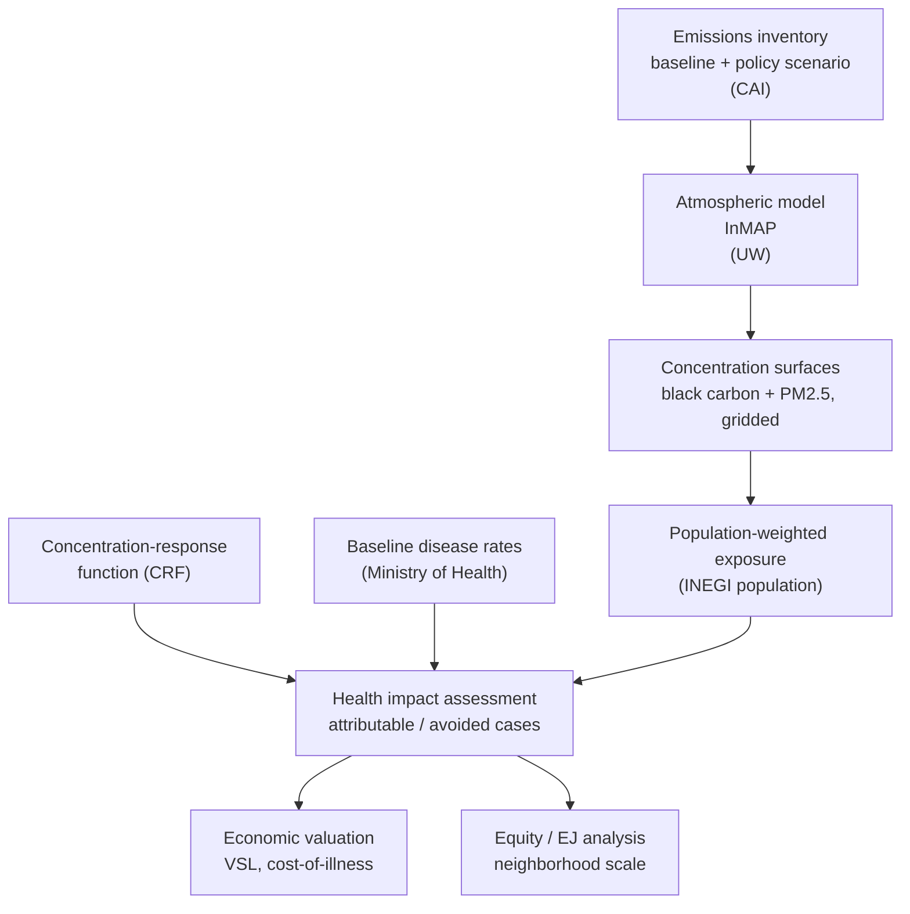

# Part 2. Health impact assessment: the method behind most of our work

## 2.1 What a health impact assessment is

A health impact assessment (HIA), in our quantitative sense, answers a deceptively simple question: how many health outcomes are caused by a given level of air pollution, or how many would be avoided by a given policy? The output is usually a number of deaths, hospital admissions, or asthma cases, often with a monetized value attached and a confidence interval around it.

Mechanically, almost every air pollution HIA multiplies four ingredients together, grid cell by grid cell or population by population, and then sums:

1. Exposure: the concentration of the pollutant where people actually are.
2. Concentration-response function (CRF): how much risk rises per unit of exposure, from epidemiology.
3. Baseline health rate: how common the outcome already is in that population (for example, the underlying death rate from heart disease).
4. Population: how many people of the relevant age are exposed.

The basic health impact function takes the exposure and the CRF to compute an attributable fraction (the share of the baseline outcome attributable to the pollutant), then applies that fraction to the baseline rate and the population to get a count of attributable cases. Change the exposure (say, under a clean air policy) and rerun, and the difference is the avoided burden. That is the whole logic. The sophistication is all in getting each of the four ingredients right.

Each ingredient matters, and it is easy to over-focus on exposure and overlook the rest. Two cities with identical pollution can have very different attributable death counts if their populations differ in age or in underlying disease rates. An older population with high background heart disease will show a larger PM2.5 burden than a young, healthy one at the same concentration. This is not a technicality: baseline health and demography drive the results as much as the pollution does, and it is one reason high-resolution baseline data matter so much (more below).

## 2.2 The four inputs in more depth

Exposure (the concentration term). Ideally we want the long-term average concentration each person breathes. We never have that exactly, so we estimate it, usually as a gridded surface of annual-average concentrations that we overlay on where people live. How we build that surface is the subject of section 2.3.

Concentration-response functions. The CRF is borrowed from epidemiology, not estimated by us. The art is in choosing the right function. For PM2.5 mortality the field has moved through several generations:
- The Integrated Exposure-Response (IER) function (Burnett and colleagues 2014) was built to span the enormous global range of exposures by combining evidence from ambient air pollution, household smoke, and smoking.
- The Global Exposure Mortality Model (GEMM) (Burnett and colleagues 2018) used only outdoor air pollution cohorts and produced substantially higher burden estimates, illustrating how much the choice of function matters.
- The Global Burden of Disease project now uses a spline-based meta-regression (MR-BRT) to fit the relative-risk curve across studies. We applied this approach in our global cities work.
You will not need to derive these, but you do need to understand that the choice of CRF is a major source of difference between studies, and that we should be explicit and consistent about which one we use and why.

Baseline health rates. These come from vital statistics and from the GBD. The key methodological point, and one of my own research findings, is that using coarse, national average disease rates can badly misrepresent inequities within a city. A wealthy and a poor neighborhood in the same city can have very different baseline mortality, so applying a single national rate hides exactly the disparities we care about. Where we can, we use the most spatially resolved baseline rates available.

Population. Gridded population datasets (for example WorldPop and the Gridded Population of the World) place people in space so we can match them to the concentration surface. The choice of population dataset and how it is disaggregated can shift urban results, something we documented in the global cities study.

Putting numbers on value: economic valuation. Many of our deliverables translate health outcomes into money, because that is the language of cost-benefit analysis and of finance ministries. Avoided deaths are valued using a value of a statistical life (VSL), and illnesses using cost-of-illness or willingness-to-pay estimates, adjusted for the income level of the country. This is where the health science meets policy. It is useful and also genuinely contested (discounting the future, assigning monetary value to a life, distributional fairness), so we handle it carefully and transparently.

## 2.3 The exposure pipeline: from emissions to concentrations to health (read this twice)

Almost every project we run is some version of this pipeline, and the Monterrey project is exactly this pipeline applied to black carbon and PM2.5 in one metropolitan area. Picture a chain with four links.

### Link 1: Emissions inventories (what comes out of the sources)

An emissions inventory is an accounting of how much of each pollutant is released, by which sources, where, and when. It answers "what is going into the air." A good inventory is spatially resolved (it knows that this stretch of highway, that cement plant, that refinery emits a certain amount) and speciated (it breaks total emissions into the specific pollutants and precursors, for example primary PM2.5, black carbon, NOx, SO2, and VOCs).

Inventories are built bottom-up by combining activity data (how many vehicle-kilometers, how much fuel burned, how much cement produced) with emission factors (how much pollutant per unit of activity). They are laborious and never perfect, and everything downstream inherits their errors. On the Monterrey project, emissions inventory development is led by Juliana Klakamp at the Clean Air Institute, and a great deal of the relevant groundwork, characterizing the sources behind the PIGECA air quality plan, was already begun under the LIMPIO project. When you evaluate a climate or clean air policy, you are really specifying two inventories: a baseline (business as usual) and a scenario (with the policy's measures applied), and the difference in emissions is what flows down the chain.

### Link 2: Atmospheric modeling (where it goes and what it becomes)

Emissions are not the same as exposure. Once in the air, pollutants are blown by wind, mixed through the atmosphere, chemically transformed (NOx and VOCs cook into ozone; gases condense into secondary particles), and eventually removed by rain or deposition. To get from "emissions here" to "concentrations there," we need an atmospheric model.

There are two broad families:

Chemical transport models (CTMs), such as GEOS-Chem, WRF-Chem, and CMAQ, simulate the physics and chemistry of the atmosphere in detail. They are the gold standard, but they demand expertise, large computing resources, and long run times, which makes running many policy scenarios impractical, especially in lower-resourced settings.

Reduced-complexity models, most importantly InMAP (the Intervention Model for Air Pollution), approximate that chemistry and transport well enough to estimate how a change in emissions changes annual-average PM2.5, at high spatial resolution, fast, and on an ordinary computer. InMAP was developed by Julian Marshall (now at the University of Washington, and our modeling subcontractor on Monterrey) with colleagues, and was published by Tessum, Hill, and Marshall in 2017; a global version followed (Thakrar and colleagues 2022). InMAP is purpose-built for exactly our kind of question, comparing emission scenarios and seeing how the resulting PM2.5 is distributed across different communities, which is why it is the modeling engine for Monterrey and why it is well suited to equity analysis. It is open source, and you can read about it and access the code through the links in the reading list.

The practical takeaway: we feed the emissions difference from Link 1 into InMAP, and InMAP tells us how concentrations change, neighborhood by neighborhood.

### Link 3: Concentrations and exposure (what people actually breathe)

The model output is a gridded surface of concentrations. To turn that into exposure, we overlay it on gridded population so each person is assigned the concentration where they live, and we compute population-weighted concentrations. Population weighting matters: a high concentration over an empty industrial zone contributes little to exposure, while a moderate concentration over a dense neighborhood contributes a lot.

We also calibrate and check modeled concentrations against real measurements wherever possible. This is why the Monterrey project invests in building out a black carbon monitoring network, ground monitors anchor and validate the modeled surfaces, and they enable the short-term epidemiology (linking daily black carbon to daily hospital admissions) that modeling alone cannot provide. Satellites are a third source of concentration information, covered in section 2.4.

### Link 4: The health impact assessment (turning concentrations into outcomes)

Now we are back to section 2.1. We take the population-weighted concentration (or the change in it under a policy), apply the chosen concentration-response function, multiply by the baseline disease rate and population, and sum to get attributable or avoided health outcomes. Add valuation and you have the economic benefit. The tool many practitioners use to operationalize this last step is the U.S. EPA's BenMAP-CE, which packages the health impact function, default CRFs, and valuation into a usable platform.

### The chain in one sentence

Emissions inventory (baseline and policy scenario) feeds an atmospheric model (InMAP), which produces concentration surfaces, which combine with population, baseline disease rates, and a concentration-response function to yield attributable and avoided health outcomes, which we then monetize. If you keep that sentence in your head, you understand how almost everything we do fits together.

The same chain as a diagram (this is a Mermaid diagram; it renders as a flowchart in GitHub, VS Code, Obsidian, and most Markdown viewers, and stays editable as text):

## 2.4 Satellites, spatial resolution, and equity

A persistent problem in this field, and one my own research deals with, is that the places with the worst air pollution often have the fewest ground monitors. Much of Latin America, Africa, and South Asia has sparse or no regulatory monitoring networks. If you can only measure pollution where there are monitors, you cannot assess the health burden where most of it occurs. Satellites are the main tool for solving this.

How satellite-derived exposure works. Earth-observing satellites measure aerosol optical depth (AOD), essentially how much sunlight airborne particles scatter and absorb in a vertical column of atmosphere. AOD is not the same as ground-level PM2.5, so researchers combine satellite AOD with a chemical transport model (which relates the column to the surface) and then calibrate the result to whatever ground monitors do exist, often using a geographically weighted regression (GWR). The output is a gridded, global surface of estimated surface PM2.5, available even where there is not a single monitor. The most widely used such product comes from the Atmospheric Composition Analysis Group (van Donkelaar, Hammer, Martin, and colleagues), with the methodology described in Hammer and colleagues (2020) and van Donkelaar and colleagues (2021); the data are freely downloadable (link in the reading list). These data are what our global cities work uses for exposure.

Why resolution matters for equity. Air pollution and the populations most harmed by it are not uniformly distributed. Highways, ports, industrial clusters, and the lower-income communities that are often sited near them experience concentrations very different from a city's average. If you assess health impacts using coarse, citywide or national-average concentrations and coarse baseline disease rates, you average away precisely the disparities you should be measuring. Higher spatial resolution, in both the concentration surface and the baseline health data, lets you see intra-urban inequities: who actually bears the burden, not just how much burden there is in aggregate. My own work has shown that using high-resolution baseline disease rates, not just high-resolution pollution, is essential to capturing these within-city inequities, because demography and underlying health vary across a city as sharply as pollution does.

This is also exactly why InMAP is valuable: it produces high-resolution concentration changes cheaply, so we can ask not only "how many deaths does this policy avoid" but "whose deaths, in which neighborhoods." Equity is not an add-on to the analysis. With the right resolution, it is something the analysis can measure directly. Who is exposed and who benefits is the question the Monterrey and Brazil projects are built to answer.

## 2.5 Major milestones and landmark assessments

A short orientation to the big efforts that shaped the field, so the names are familiar when they come up.

The Global Burden of Disease (GBD) study, produced by the Institute for Health Metrics and Evaluation, is the most influential effort. It systematically quantifies deaths and disability attributable to hundreds of risk factors, including ambient PM2.5, household air pollution, and ozone, for every country and many subnational units, updated periodically. The GBD's concentration-response functions, baseline rates, and exposure estimates are the common currency of the field; when someone cites "X million deaths from air pollution," it almost always traces back to the GBD. GBD Compare (link in the reading list) is the fastest way to pull a country or region profile.

The State of Global Air, from the Health Effects Institute in partnership with IHME, is the accessible public-facing translation of the GBD air pollution numbers, with an excellent data explorer. It is often the best first stop for a quick, citable figure.

The WHO Global Air Quality Guidelines (2021) set the health-based reference levels we compare against, and the 2021 revision substantially tightened them (the annual PM2.5 guideline dropped to 5 micrograms per cubic meter), reflecting evidence of harm at low concentrations.

The Lancet Commissions on pollution and health (Landrigan and colleagues 2018; updated by Fuller and colleagues 2022) reframed pollution as a top-tier global development and equity issue and put the roughly 9-million-deaths figure into wide circulation.

The UNEP and WMO Integrated Assessment of Black Carbon and Tropospheric Ozone (2011) and the founding of the Climate and Clean Air Coalition marked the moment the world began treating short-lived climate pollutants as a joint climate and health opportunity. That is the lineage our methane, black carbon, and SLCP work descends from.

The methodological tools, finally, are milestones in their own right: BenMAP (EPA) for running HIAs, InMAP (Tessum, Hill, and Marshall) for reduced-complexity intervention modeling, the satellite PM2.5 datasets (van Donkelaar, Hammer, Martin and colleagues) for global exposure, and LEAP-IBC (Stockholm Environment Institute) for national co-benefit assessment, which appears in our Brazil work.

## 2.6 Vetted reading list for Part 2

Concentration-response functions
- Burnett RT and colleagues. "[An integrated risk function for estimating the global burden of disease attributable to ambient fine particulate matter exposure](https://pubmed.ncbi.nlm.nih.gov/?term=An+integrated+risk+function+for+estimating+the+global+burden+of+disease+attributable+to+ambient+fine+particulate+matter+exposure)." Environmental Health Perspectives, 2014;122:397-403. (The IER function.)
- Burnett R and colleagues. "[Global estimates of mortality associated with long-term exposure to outdoor fine particulate matter](https://www.pnas.org/doi/10.1073/pnas.1803222115)." Proceedings of the National Academy of Sciences, 2018;115(38):9592-9597. (The GEMM.)

Atmospheric and intervention modeling
- Tessum CW, Hill JD, Marshall JD. "[InMAP: a model for air pollution interventions](https://doi.org/10.1371/journal.pone.0176131)." PLoS ONE, 2017;12(4):e0176131. (Open access. Our modeling engine; by our subcontractor's group.)
- Thakrar SK and colleagues. "[Global, high-resolution, reduced-complexity air quality modeling for PM2.5 using InMAP](https://doi.org/10.1371/journal.pone.0268714)." PLoS ONE, 2022;17(5):e0268714. (Open access. The global version of InMAP.)
- InMAP model home and code: [spatialmodel.com/inmap](http://spatialmodel.com/inmap/) and the [InMAP GitHub repository](https://github.com/spatialmodel/inmap).

Satellite-derived exposure
- Hammer MS and colleagues. "[Global estimates and long-term trends of fine particulate matter concentrations (1998-2018)](https://pubmed.ncbi.nlm.nih.gov/?term=Global+estimates+and+long-term+trends+of+fine+particulate+matter+concentrations)." Environmental Science and Technology, 2020;54(13):7879-7890. (DOI intentionally omitted here pending verification; the volume, issue, and pages are correct.)
- van Donkelaar A and colleagues. "[Monthly global estimates of fine particulate matter and their uncertainty](https://pubs.acs.org/doi/10.1021/acs.est.1c05309)." Environmental Science and Technology, 2021;55(22):15287-15300.
- Satellite PM2.5 data archive (Atmospheric Composition Analysis Group, Washington University in St. Louis): [dataset archive](https://sites.wustl.edu/acag/datasets/surface-pm2-5/) and [satpm.org](https://www.satpm.org).

Tools and data for running HIAs
- [U.S. EPA BenMAP-CE](https://www.epa.gov/benmap)
- IHME Global Burden of Disease and GBD Compare: [research overview](https://www.healthdata.org/research-analysis/gbd) and [GBD Compare](https://vizhub.healthdata.org/gbd-compare/)
- [Health Effects Institute, State of Global Air](https://www.stateofglobalair.org)
