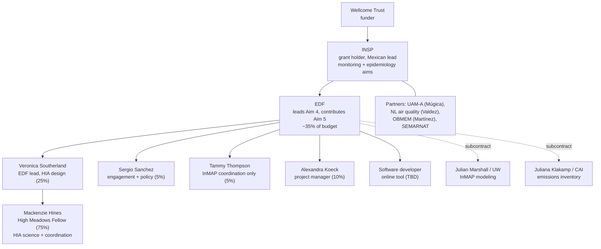
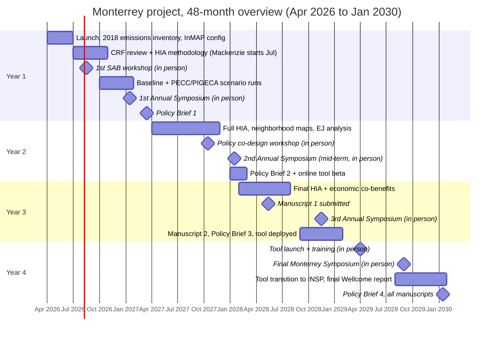

# Part 3. The projects

This part moves from a short tour of a project that is wrapping up, to the project you will spend most of your time on (Monterrey), to a practical introduction to the geospatial analysis you will be doing, and finally to the other work in our portfolio so you can see how it all connects.

A quick map of the portfolio before we dive in. Most of our work applies the same exposure-to-health pipeline from Part 2 to Latin American settings, with a shared emphasis on short-lived climate pollutants, health co-benefits of climate and clean air policy, and subnational equity. LIMPIO (Mexico, oil-and-gas methane) is finishing. Monterrey (black carbon and PM2.5 in one metro area) is launching and is your main assignment. The Brazil short-lived climate pollutant work develops a subnational health-benefits framework. They share methods and strategy.

## 3.1 Mexico methane and health: the LIMPIO project (context only, you will not be staffed on this)

LIMPIO is a Wellcome Trust-funded health impact assessment of methane emissions from Mexico's oil and gas sector, carried out in partnership with INSP. Conceptually it is the methane application of everything in Part 1, section 1.5: oil-and-gas methane drives regional ozone formation, so reducing those emissions yields both a climate benefit and a health benefit through avoided ozone-related mortality and the co-pollutants that accompany methane releases. The project produces the evidence base that Mexican stakeholders have asked for to support oil and gas methane regulation, with health benefits disaggregated to a subnational scale so they are actionable for decision-makers.

The reason it is in this guide is context, not assignment. LIMPIO is wrapping up (the synthesis is being written into one or more peer-reviewed articles, with submission targeted around mid-2026), so you will not be staffed on it. But it matters to you for two reasons. First, much of the methodological and data groundwork for Monterrey, the source characterization behind the PIGECA air quality plan, the concentration-response methodology, and the working relationship with INSP, was built through LIMPIO. Second, it is the clearest worked example in our group of the methane-to-ozone-to-health logic, so if you want to see how we turn that logic into a finished analysis, ask to see the LIMPIO materials. Key external collaborators included Omar Nawaz at Cardiff University on the atmospheric modeling side. That is as deep as you need to go for now.

## 3.2 The Monterrey project (your primary assignment)

### 3.2.1 The short version

The Monterrey project, full title "Evaluating Climate and Air Pollution Mitigation Strategies in the Metropolitan Area of Monterrey, Nuevo León: Public Health Benefits of Black Carbon Reduction," is a four-year (48-month) climate, air quality, health, and economic assessment of the Monterrey Metropolitan Area (Zona Metropolitana de Monterrey) in the state of Nuevo León, Mexico. It runs from April 2026 through January 2030. It is funded by the Wellcome Trust, with INSP (Mexico's National Institute of Public Health) as the grant holder and EDF as a subawardee. EDF's portion is roughly 35% of the total project budget (on the order of $826,000 of about $2.4 million total). The central aim is to evaluate the health, environmental, and socio-economic impacts of two existing Mexican climate and clean air strategies, the federal PECC and the regional PIGECA, with a particular focus on reductions in black carbon and the associated co-benefits for PM2.5. The work spans monitoring, modeling, epidemiology, and stakeholder engagement, and is designed to generate evidence that helps decision-makers prioritize the interventions that deliver the largest combined climate, health, and social benefits.

The project is organized around several aims. EDF leads Aim 4, the development of an integrated, flexible analytical capability to estimate emissions, air quality, and health benefits from PECC and PIGECA interventions, including the air quality modeling, the health impact assessment, the economic valuation, and an interactive online policy tool. EDF also contributes to Aim 5, stakeholder engagement. The monitoring and epidemiology aims (including the black carbon monitoring network and the time-series analysis linking black carbon to hospital admissions over 2022 to 2029) are led on the Mexican side by INSP and partners. Keeping that division clear is useful: most of what you will touch sits in Aim 4.

### 3.2.2 Why Monterrey, and why black carbon

Monterrey is one of Latin America's largest and most economically dynamic metropolitan areas, an industrial powerhouse (notably cement, steel, and a major refining and manufacturing base) set in a mountain-ringed basin in northeastern Mexico that traps pollution. It consistently ranks among Mexico's most polluted urban areas. That combination, heavy industry, dense population, challenging terrain, and active local and state interest in air quality, makes it an unusually good place to demonstrate that climate action and clean air action can be the same action.

Black carbon is the project's organizing pollutant for the reasons in Part 1: it is both a component of health-damaging PM2.5 and one of the most potent short-lived warming agents, so reducing it is a genuine climate-and-health "win-win." It is emitted largely from diesel engines, industry, and combustion, exactly the sources that Monterrey's climate and air quality plans target. By centering black carbon, the project can speak to the climate ministry and the health and air quality authorities in the same breath.

### 3.2.3 What the project will produce

It helps to separate EDF's own deliverables (Aim 4 and our part of Aim 5) from the partner-led outputs.

EDF's deliverables, the work you will be closest to, include:

- the emissions-to-air-quality modeling for the policy scenarios, run in InMAP in coordination with UW, producing annual-average black carbon and PM2.5 concentration fields across the metro area under baseline and under PECC and PIGECA intervention scenarios;
- the health impact assessment itself: neighborhood-scale estimates of black-carbon- and PM2.5-attributable mortality and morbidity, including sensitivity analyses and results stratified by age, sex, socioeconomic status, and disease;
- an environmental justice analysis of how the health risks and the policy benefits are distributed across communities;
- economic valuation of the health co-benefits (value of a statistical life and cost-of-illness approaches, with Mexico-specific values);
- an interactive, web-based online policy tool that lets users input scenarios and see the resulting air quality, health, and equity outcomes on a map, developed in phases and ultimately transitioned to INSP (more on this in section 3.4);
- four policy briefs over the life of the project, two to three peer-reviewed manuscripts, conference presentations, and all datasets and code archived openly on Zenodo and GitHub.

Partner-led outputs that EDF supports but does not own include the build-out of a black carbon monitoring network across the metro area, the resulting black carbon database (covering roughly 2022 through 2029), and the time-series epidemiology linking black carbon to respiratory and cardiovascular hospital admissions. These are led on the Mexican side (INSP and partners), and their results feed into our final health impact assessment.

### 3.2.4 Who does what (project structure)

The EDF team and its roles, with the effort levels from the work plan, are:

- Veronica Southerland (Scientist, Global Clean Air), about 25% effort: overall EDF lead, coordinates Aim 4, leads the health impact assessment design and the equity analysis, is the primary liaison to the Clean Air Institute, leads on manuscripts, and handles science-to-policy translation. Your direct mentor.
- Sergio Sanchez (Senior Policy Director, Clean Air and Health), about 5% effort: leads stakeholder engagement, the advisory-board workshops, the policy briefs, and government liaison. Mexico-based.
- Tammy Thompson (Senior Air Quality Scientist), about 5% effort: her involvement is limited specifically to InMAP modeling coordination with UW.
- Alexandra Koeck (Project Manager, Healthy Communities), about 10% effort: project coordination, timelines, subcontractor oversight, and meeting logistics. (Note the spelling, Alexandra, not Alexander.)
- A software developer (subcontractor, to be hired): builds and deploys the online tool.
- Julian Marshall (University of Washington, professor) is the InMAP modeling subcontractor.
- Juliana Klakamp (Clean Air Institute, COO) is the emissions inventory subcontractor.

Senior EDF program leadership (for example Sarah Vogel and Ananya Roy) provide oversight at the program level; they are not part of the day-to-day project team in the work plan, but you may see their names. On the Mexican side, INSP is the grant holder and leads the monitoring and epidemiology aims under Dr. Marlene Cortez-Lugo, with a partner network that includes Violeta Múgica Álvarez (UAM-Azcapotzalco, which contributes monitoring data), Armandina Valdez Cavazos (Nuevo León's air quality authority within the state environmental secretariat), Selene Martínez Guajardo (OBMEM), and the relevant federal (SEMARNAT) and state agencies. Full profiles are in Part 4.

You, Mackenzie, join in July 2026 as a High Meadows Fellow at 75% total effort, split roughly in half between programmatic and project-coordination support and hands-on science support working directly with me. You also attend one in-person trip per year to Monterrey, for the annual symposium.

An informal map of who sits where (not a strict reporting chart, just how the pieces relate):

### 3.2.5 What you will specifically work on

Your role is scoped to EDF's science support and project coordination, not the entire multi-partner project and not the parts that belong to the subcontractors (UW does the InMAP runs, the Clean Air Institute does the emissions inventory, and the software developer builds the tool). Your science half centers on the health impact assessment and everything feeding it: literature synthesis, data management, the analysis itself, and manuscript preparation, all working directly with me. Your programmatic half is project coordination: tracking deliverables, supporting meetings, and helping keep the EDF, UW, CAI, and INSP threads moving. That coordination work is genuinely valuable, not busywork.

Concretely, the work plan has you stepping into a specific sequence. Because you start in July 2026, which is Month 4 of the project, your first real task is the concentration-response function (CRF) literature review: identifying and documenting candidate Mexico-relevant CRFs for the health endpoints we will use (all-cause and cardiovascular mortality, cardiovascular emergency-department visits and hospitalizations, and respiratory hospitalizations). From there your first several months map roughly to:

- August to October 2026: helping design and then finalize the HIA methodology document (defining health endpoints, data sources, the log-linear health impact function, and the population-data strategy), and finalizing the CRF selection.
- November 2026: producing preliminary health benefit estimates for the first PECC scenarios.
- December 2026: building out the economic valuation framework with me.
- January 2027: contributing to the inputs for Policy Brief #1, and attending the first annual symposium in Monterrey in person.

Over Years 2 and 3, your work grows into the main part of the analysis: the full neighborhood-scale HIA, the sensitivity analyses and stratified results (by age, sex, socioeconomic status, and disease), the environmental justice analysis, and manuscript preparation, where you are a co-author on the first paper (the air quality and health co-benefits modeling) and work closely with me on the second (the neighborhood-scale equity analysis). You will also support stakeholder engagement and the policy briefs along the way.

A note on what you do not need to arrive knowing: you are not expected to run InMAP yourself or build the emissions inventory. You will learn enough about both to work fluently at the interface with them, but the modeling and inventory are the subcontractors' lanes. Your lane is turning their outputs into health and equity results, and communicating those. Much of the engagement and some materials are bilingual, so building toward working Spanish helps and is something the team supports.

### 3.2.6 The work plan and where the real task list lives

There is a detailed EDF work plan for the project (the "EDF Monterrey work plan"), and it is the operational companion to this guide. It lays out the full 48 months in several views: a Gantt chart of deliverables and meetings; the complete list of deliverables committed to the Wellcome Trust (including the online tool); a summary of EDF deliverables by quarter with the responsible leads; the EDF budget and travel allocations; the full schedule of convenings; and, most usefully for you, a month-by-month task table for every month of the project, naming the responsible staff. Your name appears against specific months starting in July 2026, which is where the sequence in section 3.2.5 comes from.

The cadence of convenings is worth absorbing early, because it structures the year. There are advisory-board ("SAB") dialogue workshops several times a year (one in person per year, the rest online), an in-person annual symposium each January (or November in Year 3), a policy co-design workshop in Year 2, a tool launch and training in Year 4, monthly partner coordination calls, and quarterly all-partner reviews. You attend the annual symposium in person each year.

Treat the work plan as the source of truth for what is due when, alongside whatever live project-management board (for example Asana) the team is using to track current status, set up with Alexandra Koeck. This guide explains the why and the how; the work plan and the live board tell you the what and the when. In your first week, plan to walk the Year 1 plan end to end with me and Alexandra. One status note for context: the project launched with the EDF-INSP agreement and the UW and CAI subcontracts being finalized, and INSP ethics review for the hospital-admissions work initiated in late 2025, so expect some of those early items to have moved by the time you read this.

A high-level view of the 48 months (Mermaid Gantt diagram; dates are indicative and follow the work plan's stated months and quarters, the work plan itself is authoritative):

### 3.2.7 Background documents to read for Monterrey

These are the primary-source policy documents and methods references behind the project. The two Mexican policy plans are essential reading because the entire modeling exercise is built on evaluating their interventions.

- PECC, Programa Especial de Cambio Climático. Mexico's federal special climate change program. This is the federal climate policy whose measures we model for their black carbon and PM2.5 co-benefits. Get the current official version from the team or from the federal government portal (gob.mx / SEMARNAT). [Add direct link once confirmed with the team.]
- PIGECA, Programa Integral de Gestión de la Calidad del Aire, for the Monterrey area / Nuevo León. The regional integrated air quality management program. This, together with the area's climate action measures, defines the interventions we evaluate. Get the official PDF from Nuevo León's state environmental secretariat or from the team. [Add direct link once confirmed with the team.]
- The team has already gone through these plans and flagged the specific interventions most relevant to black carbon and PM2.5. They cluster into transportation measures (for example shifting urban freight to cargo bikes, scrappage and renewal of old diesel freight vehicles, expansion of mass transit and bus rapid transit, modal shift of freight from road to rail, and active-mobility infrastructure), industrial measures (for example efficiency and fuel switching in cement production, reducing petroleum coke use, and efficiency in oil refining), and urban planning measures (for example expanding urban green areas and tree cover). Ask me for the mapping of these to their specific numbered measures in the plans; that mapping, begun under LIMPIO, is a key internal input and is worth reviewing carefully, since it is what defines our emission scenarios.
- InMAP, the modeling engine. Read Tessum, Hill, and Marshall (2017) and the Global InMAP paper (Thakrar and colleagues 2022), both in the Part 2 reading list, and browse the InMAP model site and code. This is the tool that turns the PECC and PIGECA intervention scenarios into concentration changes. For Monterrey it is configured on a variable-resolution grid (roughly 1 km in the urban core, coarser in rural areas), drawing on EPA 2017 CMAQ pre-processed inputs.
- Our own global cities methods papers (Southerland 2022; Anenberg 2022, in the Part 1 reading list) are the closest published examples of the HIA methods we will apply here.

A quick orientation to the key inputs and parameters the work plan specifies, so the data names are familiar when you meet them:

- Emissions: the 2018 Monterrey Metropolitan Area emissions inventory from the Clean Air Institute, covering PM10, PM2.5, NOx, SO2, CO, VOC, NH3, black carbon, CO2, CH4, and N2O across source categories. This is the baseline for the scenarios.
- Policy actions: PECC contains on the order of 141 mitigation actions, and PIGECA (2024) carries its own emission-reduction assessments; the early Aim 4 work maps these actions to emission source categories to build the scenarios.
- Population: municipality-level data from INEGI (Mexico's national statistics institute).
- Baseline disease rates: from Mexico's Ministry of Health.
- Concentration-response functions: Mexico-relevant CRFs for PM2.5 and black carbon, selected through the literature review you will help lead.
- Health impact function: a log-linear form.
- Economic valuation: value of a statistical life (willingness-to-pay) and cost-of-illness, using Mexico-specific values.
- Target journals for the manuscripts include Environmental Health Perspectives and The Lancet Planetary Health; data and code are archived on Zenodo and GitHub.

## 3.3 An introduction to geospatial analysis for health impact assessment

Almost everything we do is spatial: concentrations on a grid, people on a grid, disease rates by area, sources at points and along lines. So a working comfort with geospatial analysis is one of the most useful skills you can build here. This section is a practical orientation, not a course.

The core mental model. A health impact assessment is, geometrically, a stack of aligned map layers: a concentration surface, a population surface, a baseline-disease-rate layer, and administrative boundaries. The analysis is largely about getting those layers onto a common grid and projection, multiplying them together cell by cell, and summing within the units you care about (a neighborhood, a municipality, the whole metro area). If you understand that you are stacking and combining aligned rasters and polygons, you understand the spatial part of the method.

Concepts worth knowing early:

- Raster versus vector. Rasters are gridded surfaces (concentration fields, population grids, satellite products). Vectors are points, lines, and polygons (monitor locations, roads, administrative boundaries). HIA mixes both.
- Coordinate reference systems and projections. Layers must share a projection before you combine them. Mismatched projections are the most common source of silent error. Area-preserving projections matter when you are summing population or area.
- Resolution and the modifiable areal unit problem. Results depend on the spatial scale of your inputs. As discussed in Part 2, coarse inputs average away inequities. The "modifiable areal unit problem" is the formal name for the fact that how you draw and size your units changes your answers, something to be deliberate about.
- Population weighting and zonal statistics. Summarizing a concentration surface over a population grid, or over administrative polygons, is the everyday operation. These are "zonal statistics."

Tools. Our group works primarily in R for geospatial analysis and health impact assessment, which lets us script reproducible workflows end to end. The key R packages to get familiar with are the modern spatial stack: terra and sf for raster and vector handling, plus the tidyverse for data manipulation and ggplot2 for mapping. (You will also encounter QGIS, a free desktop geographic information system, useful for quick visualization and inspection.) If you are newer to R, a good early investment is the freely available textbook [Geocomputation with R](https://r.geocompx.org) (Lovelace, Nowosad, and Muenchow), which teaches exactly the sf-and-terra workflow we use. For the HIA-specific steps, the EPA's BenMAP-CE (Part 2 reading list) is the standalone tool, and we also implement health impact functions directly in R for flexibility.

What "getting good at this" looks like here. You do not need to be an expert on day one. A reasonable arc: first, be able to load a raster and a set of polygons, align them, and compute a population-weighted average concentration; next, be able to apply a concentration-response function over a grid to produce attributable cases; then, be able to do the same for a scenario and compute the difference (the avoided burden); and finally, be able to disaggregate that result to show how it is distributed across areas, which is the equity analysis. We will build up to this together, and the LIMPIO and global-cities code are good worked examples to learn from.

## 3.4 The online tools: the Monterrey policy tool and a broader open HIA platform

There are two related but distinct tool efforts, and it is worth keeping them separate.

The Monterrey online policy tool is a funded deliverable of the project, part of EDF's Aim 4. It is an interactive, web-based tool that lets a user choose PECC or PIGECA intervention scenarios and see the resulting changes in air quality, the attributable health benefits, the economic value, and the equity (neighborhood-scale) results on a map. The work plan builds it in stages: a scoping document, then a backend data pipeline connecting emissions to InMAP to HIA outputs, then map and economic-valuation display layers, then environmental justice layers and a scenario-comparison feature, then alpha and beta testing (including with INSP and advisory-board members), then a deployed final version, and finally a formal transfer of hosting and documentation to INSP with maintenance protocols through 2030. A subcontracted software developer builds it; I coordinate it on the EDF side. Your connection to it is mainly on the science side, making sure the HIA outputs that feed the tool are correct and well-documented, rather than on the software build itself.

Separately, I have been developing a broader, open-access "HIA walkthrough" concept: a guided tool that walks a non-specialist through the steps of a health impact assessment using accessible global data, to lower the barrier for researchers and decision-makers in data-sparse regions who cannot run BenMAP or a chemical transport model. It takes inspiration from BenMAP but aims to be lighter weight, more guided, and globally usable, and there is a product requirements document for it. It is not a funded Monterrey deliverable, but it is conceptually adjacent to the Monterrey tool and to the methods you will be learning. If it interests you, say so; there may be room to contribute.

## 3.5 Other portfolio work: Brazil and short-lived climate pollutants, and how it all connects

### The Brazil short-lived climate pollutant work

In parallel with the Mexico work, our group is supporting Brazil's first National Short-Lived Climate Pollutants (SLCP) Plan. Under the leadership of Brazil's Ministry of Environment and Climate Change, and consistent with a protocol of intentions between the ministry and EDF, the Climate and Clean Air Coalition and the Stockholm Environment Institute are preparing the plan, with SEI conducting national-scale modeling of climate and air quality health benefits using the LEAP-IBC tool.

EDF's value-add is to push that national analysis to a subnational, equity-focused level. The national framework is important for federal policy, but Brazil's regional differences in emissions, exposure, and baseline health are large, so a national average can hide who actually benefits. Our proposed contribution develops a framework for assessing how SLCP mitigation measures produce health benefits at different scales (national, regional, urban) and across sectors, with a qualitative first-phase assessment of how those benefits are distributed across priority regions (for example the Amazon, the São Paulo metropolitan area, and rural areas), intended to serve as an annex to the national plan. A fuller quantitative phase, with air quality modeling, would follow. (A practical scheduling note carried in the project materials: Brazil's electoral blackout period constrains some government-facing activity during part of 2026, though technical meetings continue.)

### How the projects connect

Why these are one program rather than three unrelated grants:

- Shared scientific spine. LIMPIO (methane and ozone), Monterrey (black carbon and PM2.5), and the Brazil work (the full SLCP set) are all applications of the same exposure-to-health-to-economics pipeline from Part 2, to short-lived climate pollutants, in Latin America.
- Shared strategic frame: co-benefits. Each project is built on the premise that climate action and clean air action are the same action, and that quantifying the health benefit strengthens the policy case. That frame is what makes the work fundable by health funders like the Wellcome Trust and relevant to climate ministries at the same time.
- Shared equity emphasis. All three insist on subnational, distributional analysis, not just national totals, because the point is to show who is exposed and who benefits, and to inform interventions accordingly.
- Shared methods and tools, transferable across settings. The InMAP modeling, the concentration-response and valuation methods, the satellite exposure data, and increasingly the framework documents themselves are designed to be portable, so a method honed in Mexico can support Brazil and beyond. Part of the long-term aim is exactly this: methods that lower- and middle-income countries can adopt.

Understanding those connections will help you see how your Monterrey work fits a larger strategy, and why the skills you build are valuable well beyond a single project.

## 3.6 Science-to-policy translation: how the analysis becomes impact

One thing shapes everything here. EDF is not a university department, it is an environmental organization whose purpose is to change real-world decisions. The science we do is rigorous because it has to be, but it is not done for its own sake. It is done so that a finance ministry, a state government, an air quality authority, or a community group can act differently. That orientation, science in service of decisions, is the difference between our work and a purely academic project, and it should inform how you approach your own pieces.

Who the audiences are. A single analysis usually has to speak to several audiences at once, and they care about different things:

- Federal decision-makers (SEMARNAT and the owners of the PECC) care about national climate and air commitments and how interventions perform.
- State and municipal government in Nuevo León (and the air quality authority behind PIGECA) care about local, actionable choices: which interventions, where, with what local benefit.
- INSP and the health sector care about the health evidence and its credibility.
- Communities and civil society care about who is affected and whether the process reflects their needs.
- The scientific community cares about method and peer review.
- The funder (Wellcome Trust) cares about impact and rigor together.

The output types and their registers. Part of translation is choosing the right vehicle and pitching it correctly. The same underlying analysis becomes:

- a peer-reviewed manuscript (for scientific credibility; long, technical, slow, and the foundation everything else cites);
- a policy brief (for decision-makers; short, leads with the decision-relevant finding, light on method, heavy on "so what" and "what to do"). The project produces four of these, and you will contribute inputs;
- a technical report (for documentation and for partners who need the full method);
- the interactive online tool (decision support people can use themselves);
- community-facing materials and infographics (accessible, often bilingual);
- conference presentations (for the scientific community, for example ISEE and AGU).

A common newcomer instinct is to write everything like a methods section. The skill is moving fluidly between registers: the same result stated for a modeler, for a minister, and for a community member reads very differently.

The craft of translation. A few moves recur in our work:

- Lead with the decision-relevant finding, not the method. For a policymaker, "intervention X avoids roughly N deaths a year, worth $Y" comes first; the modeling comes later or in an appendix.
- Monetize, because finance and planning ministries think in costs and benefits. This is why the value-of-a-statistical-life and cost-of-illness work in Part 2 matters: it puts health into the language of budgets.
- Disaggregate to who and where. "This neighborhood benefits most" is far more actionable for a city than a metro-wide average. The equity and neighborhood-scale analysis is not just scientifically richer, it is what makes results usable locally.
- Use the co-benefits frame to speak to climate and health audiences at once. This is the main argument of the program.
- Be precise about uncertainty rather than hiding it. Credibility is the whole asset; one oversold number can cost it. This is why our house style is to never dress up an approximation as precision, and to state ranges and assumptions plainly.

Co-design, not just dissemination. Notice that engagement is built into the project from the start (the advisory-board workshops, the policy co-design workshop), not bolted on at the end. The point is that stakeholders help shape the questions, so the analysis answers things decision-makers actually need, and so the results land with people who helped build them. When you support engagement, you are not doing outreach about finished science, you are helping make sure the science is the right science.

How you will contribute. Concretely, you will help draft policy-brief inputs, make figures and maps legible to non-scientists, ensure the numbers feeding external materials are exactly right, and support bilingual communication. Getting good at translation, holding rigor and clarity at the same time, is one of the most useful skills you can take from this fellowship.
